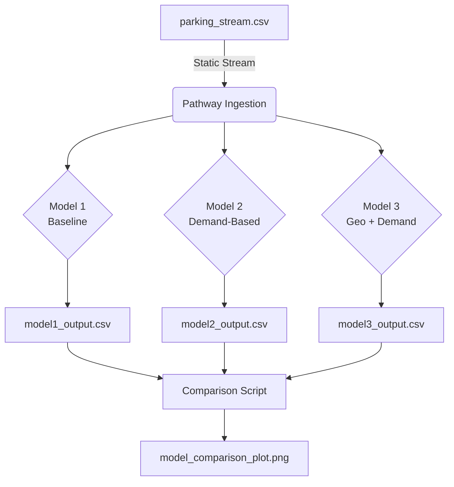

# Urban Parking Dynamic Pricing - Summer Analytics 2025 Capstone Project

## Project Overview

This project implements a dynamic pricing system for urban parking spaces using time-series and geo-spatial data. We developed three pricing models:
1. **Model 1**: Baseline static pricing based on occupancy ratio.
2. **Model 2**: Demand-based dynamic pricing.
3. **Model 3**: Demand + Geo-spatial neighbor-aware pricing.

The goal is to optimize parking prices in real time based on demand patterns and nearby lot availability.

---

## Tech Stack

- Python 3.11
- Pandas, NumPy, Matplotlib
- Pathway (for real-time stream processing)
- Geopy (for spatial distance)
- Jupyter Notebook
- Git, GitHub

---

## Workflow Explanation
1. **Data Preprocessing**: Clean raw CSV and create engineered features.
2. **Model 1: Baseline**: Price = base + α × occupancy/capacity
3. **Model 2: Demand-Based**: Adjusted pricing based on local demand from neighboring lots.
4. **Model 3: Geo + Demand**: Combines spatial and temporal features to estimate competitive pricing.
5. **Comparison**: All models evaluated across timestamps and visualized.

---

## Repository Structure
- `Urban_Parking_Dynamic_Pricing.ipynb` – main notebook with implementation
- `parking_stream.csv` – sample stream for Pathway
- `baseline_output.csv`, `model2_output.csv`, `model3_output.csv` – pricing outputs
- `comparison_plot.png` – final plot comparing prices
- `README.md` – this file

---

## Architecture Diagram

---

# Other Files in the repo
The other files in this repo are : 
Week 1 code file - Hrishita_Answers_SA2025_W1.ipynb
1st hackathon code file - Summer_Analytics_Assignment_2.ipynb
2nd hackathon code file - Summer_Analytics_final_hackathon.ipynb
